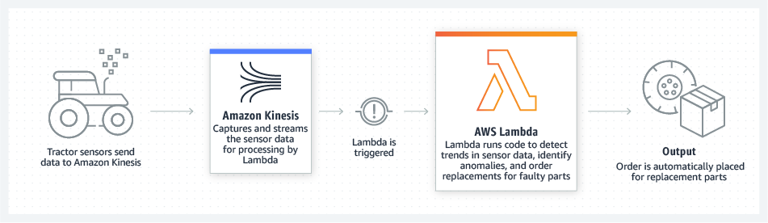

#### 🌩️ AWS Lambda

🎬 [**San**](https://sanspace.in)thosh Srinivasan

---

#### What?

  - Function as a Service (FaaS)
  - Serverless
  - Event Driven Architecture
  - Stateless

#### Why?

  - No servers to manage (NoOps)
  - Continuous scaling
  - Cost optimized with millisecond metering
  - Consistent performance at any scale
  - Supports Containers

#### How?

<small>https://aws.amazon.com/lambda/</small>

---

#### Sample Use Cases

  - Alexa Skills
  - Image Thumbnails

#### Real-time File Processing

<small>https://aws.amazon.com/lambda/</small>

#### Real-time Stream Processing

<small>https://aws.amazon.com/lambda/</small>

#### Web App

<small>https://aws.amazon.com/lambda/</small>

#### IoT Backend

<small>https://aws.amazon.com/lambda/</small>

---

#### Languages

  - Node.js
  - Python
  - Ruby
  - Java
  - Go
  - C#
  - Powershell

#### Quotas

  - Concurrency
  - Memory
  - Storage
  - Duration

<small>https://docs.aws.amazon.com/lambda/latest/dg/gettingstarted-limits.html</small>

#### When not to use?

  - Batch Processing (long running task that cannot be split up)
  - Control over environment/server
  - Preserve State (need DB or Storage in addition)

---

#### Further Reading

  - [AWS SAM](https://aws.amazon.com/serverless/developer-tools/)
  - [Lambda@edge](https://aws.amazon.com/lambda/edge/)

---

#### Resources 🔖

  - Official [Docs](https://aws.amazon.com/lambda/)
  - [Tutorials](https://aws.amazon.com/lambda/resources/?aws-lambda-resources-blog.sort-by=item.additionalFields.createdDate&aws-lambda-resources-blog.sort-order=desc#Tutorials)
  - [Reference Architectures](https://aws.amazon.com/lambda/resources/?aws-lambda-resources-blog.sort-by=item.additionalFields.createdDate&aws-lambda-resources-blog.sort-order=desc#Tutorials)
  - [Tech Talks](https://aws.amazon.com/lambda/resources/?aws-lambda-resources-blog.sort-by=item.additionalFields.createdDate&aws-lambda-resources-blog.sort-order=desc#Tutorials)

---

#### References 📚

  - Official [Docs](https://aws.amazon.com/lambda/)

---

#### Feedback 🗣️

  - This deck is on [Github](https://github.com/sanspace/lambda). Issues/PRs are appreciated!
  - Reach out to [me](https://sanspace.in).
